# comfy_IrodoriTTS

ComfyUIで[Irodori-TTS](https://github.com/Aratako/Irodori-TTS)を使うためのカスタムノードです。

本カスタムノードは、Irodori-TTSと、そのフォーク版である[Emoji-TTS](https://github.com/iron-mukakin/Emoji-TTS)を元にしています。

テキストから音声を生成し、必要に応じて参照音声による話者指定、VoiceDesign用キャプション、CFG調整、Rescale補正、IrodoriTTS向けLoRAを組み合わせられます。

## 主な機能

- IrodoriTTSチェックポイントの読み込み
- テキスト読み上げ音声の生成
- 音声または動画ファイルからの参照話者指定
- VoiceDesignモデル向けの声質・話し方キャプション指定
- CFG、Duration、Rescale、Schedule、Trim Tail、speaker K/V補正などの詳細設定
- IrodoriTTS向けLoRAの適用
- IrodoriTTSで使いやすい絵文字ピッカー
- Irodori Character Voiceモデル向けのキャラクター画像条件生成

各ノード入力の詳しい説明は[docs/parameters.md](docs/parameters.md)を確認してください。

## インストール

1. ComfyUIの`custom_nodes`ディレクトリにこのリポジトリを配置します。

   ```bash
   cd ComfyUI/custom_nodes
   git clone https://github.com/jupo-ai/comfy_IrodoriTTS.git
   ```

2. ComfyUIで使用しているPython環境を有効化し、依存関係をインストールします。

   ```bash
   cd ComfyUI
   pip install -r custom_nodes/comfy_IrodoriTTS/requirements.txt
   ```

3. IrodoriTTSのチェックポイントをComfyUIの`models/checkpoints`に配置します。

   例:

   ```text
   ComfyUI/models/checkpoints/irodori_tts/model.safetensors
   ```

4. ComfyUIを再起動します。

## モデルについて

IrodoriTTSのモデルはComfyUI標準の`checkpoints`一覧から選択します。

チェックポイント例:

- [Aratako/Irodori-TTS-500M-v3](https://huggingface.co/Aratako/Irodori-TTS-500M-v3)
- [Aratako/Irodori-TTS-500M-v2](https://huggingface.co/Aratako/Irodori-TTS-500M-v2)
- [Aratako/Irodori-TTS-500M-v2-VoiceDesign](https://huggingface.co/Aratako/Irodori-TTS-500M-v2-VoiceDesign)
- [Aratako/Irodori-TTS-500M](https://huggingface.co/Aratako/Irodori-TTS-500M)

チェックポイントの`latent_dim`に応じて、内部で使用するcodecが自動選択されます。

- `latent_dim = 32`: `Aratako/Semantic-DACVAE-Japanese-32dim`
- `latent_dim = 128`: `facebook/dacvae-watermarked`

codecとtokenizerは初回ロード時にHugging Faceから自動ダウンロードされます。手動で配置が必要なのは、基本的にIrodoriTTSのチェックポイントのみです。

自動ダウンロードされたファイルは、このカスタムノード内の`data`ディレクトリに保存されます。

- tokenizer: `custom_nodes/comfy_IrodoriTTS/data/tokenizers`
- codec: `custom_nodes/comfy_IrodoriTTS/data/codecs/<repo_id>`

codecの`<repo_id>`部分は、`/`を`_`に置き換えたディレクトリ名になります。例: `facebook/dacvae-watermarked`は`custom_nodes/comfy_IrodoriTTS/data/codecs/facebook_dacvae-watermarked`に保存されます。

## 基本的な使い方

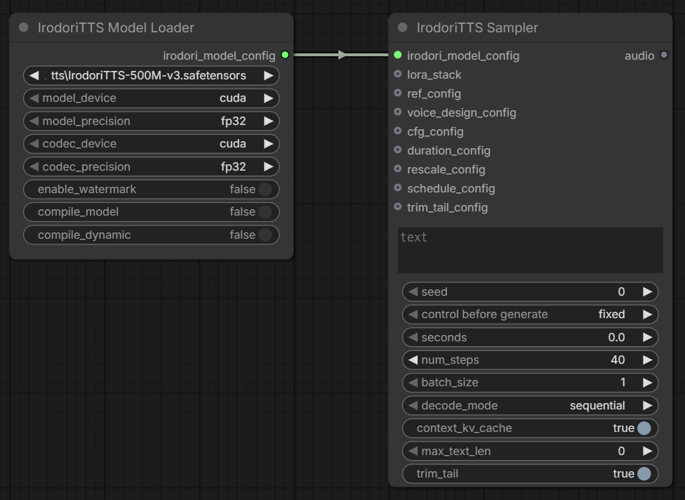

最小構成では、次の2ノードだけで音声を生成できます。

1. `IrodoriTTS Model Loader`
2. `IrodoriTTS Sampler`

接続:

```text
IrodoriTTS Model Loader
  irodori_model_config
    -> IrodoriTTS Sampler / model_config
```

`IrodoriTTS Sampler`の`text`に読み上げたい文章を入力し、`seconds`で生成秒数、`num_steps`でサンプリングステップ数、`seed`で乱数シードを指定します。v3モデルでは`seconds = 0`で自動秒数推定を使用できます。

## 参照音声を使う

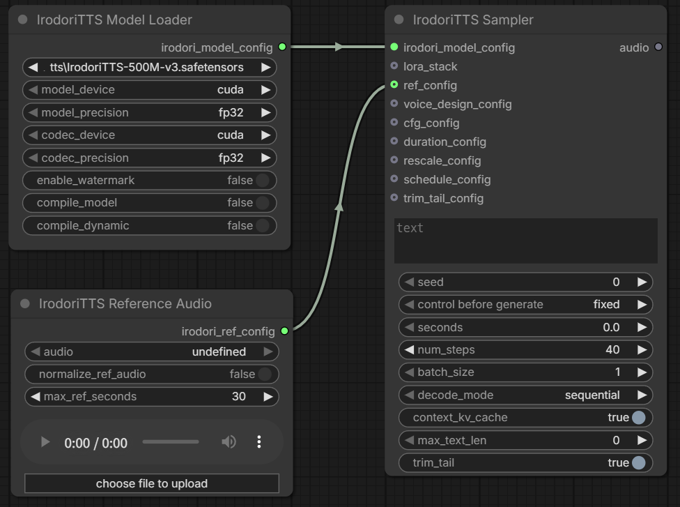

話者や雰囲気を参照音声に寄せたい場合は、`IrodoriTTS Reference Audio`を追加して`IrodoriTTS Sampler`へ接続します。
VoiceDesignモデルでは機能しません。

```text
IrodoriTTS Reference Audio
  irodori_ref_config
    -> IrodoriTTS Sampler / ref_config
```

参照ファイルはComfyUIの`input`フォルダから選択します。音声ファイルに加えて、動画ファイルも指定できます。動画を指定した場合はffmpegで音声を抽出します。

参照音声の音量差が大きい場合は、`normalize_ref_audio`を有効にしてください。長い参照音声は`max_ref_seconds`で先頭から使用する秒数を制限できます。

## VoiceDesignモデルを使う

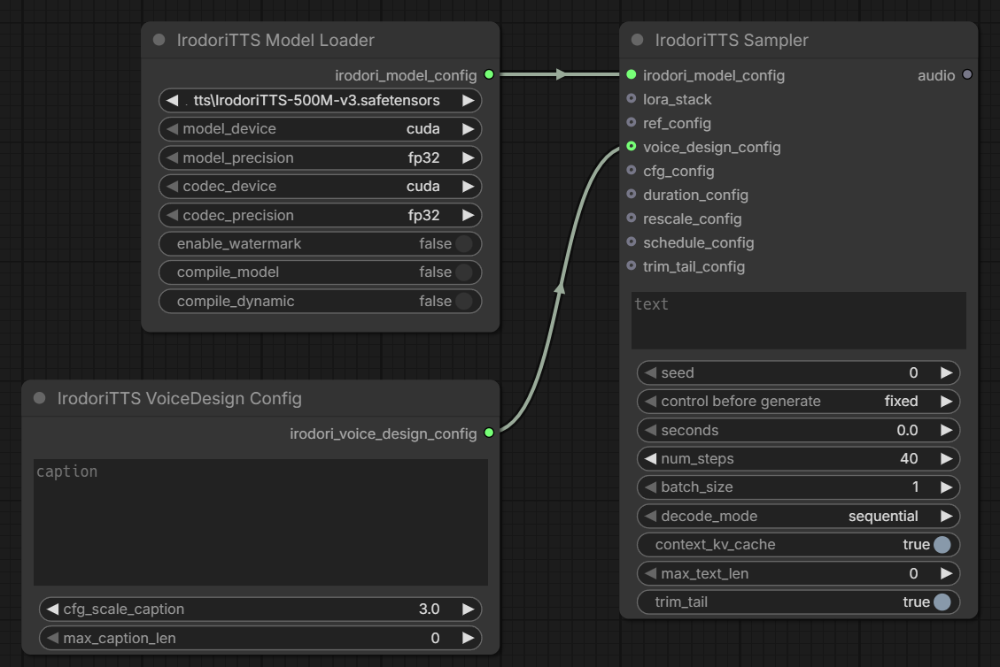

VoiceDesign対応モデルでは、`IrodoriTTS VoiceDesign Config`を接続して声質や話し方を文章で指定できます。

```text
IrodoriTTS VoiceDesign Config
  irodori_voice_design_config
    -> IrodoriTTS Sampler / voice_design_config
```

`caption`には声質、話速、感情、話し方などの説明文を入力します。`cfg_scale_caption`を上げるとキャプションへの追従が強くなります。

通常のIrodoriTTSモデルでは、このノードは接続不要です。

## LoRAを使う

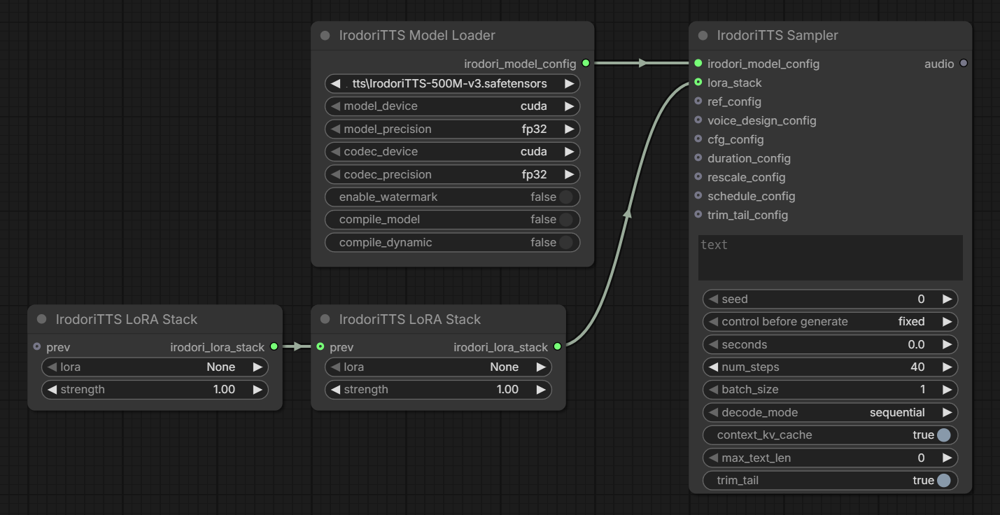

IrodoriTTS向けLoRAはComfyUIの`models/loras`に配置し、`IrodoriTTS LoRA Stack`から選択します。

```text
IrodoriTTS LoRA Stack
  irodori_lora_stack
    -> IrodoriTTS Sampler / lora_stack
```

複数のLoRAを使う場合は、`IrodoriTTS LoRA Stack`の`prev`に前段の出力を接続して積み重ねます。

`strength`はLoRAの適用強度です。`1.0`が標準、`0.0`は実質無効です。

## ノード一覧

### IrodoriTTS Model Loader

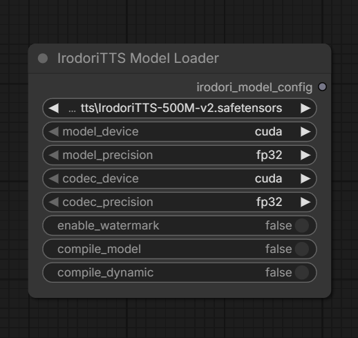

IrodoriTTSのチェックポイントと実行設定をまとめた`irodori_model_config`を出力します。

主な入力:

- `model`: 使用するチェックポイント
- `model_device`: TTSモデルを実行するデバイス
- `model_precision`: TTSモデルの計算精度
- `codec_device`: codecを実行するデバイス
- `codec_precision`: codecの計算精度
- `enable_watermark`: codec側のウォーターマーク処理
- `compile_model`: `torch.compile`の使用
- `compile_dynamic`: `torch.compile`のdynamicモード

通常は`model_device = cuda`、`model_precision = bf16`または`fp32`、`codec_device = cpu`または`cuda`から環境に合わせて選びます。

> [!WARNING]
> 旧版における `huggingface` からモデルをDLするノードは削除されました。

### IrodoriTTS Sampler

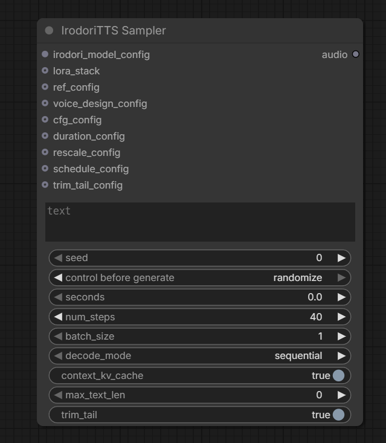

テキストから音声を生成します。出力はComfyUI標準の`AUDIO`です。

主な入力:

- `model_config`: `IrodoriTTS Model Loader`の出力
- `text`: 読み上げるテキスト
- `seed`: 生成シード
- `seconds`: 生成する音声長
  - v3モデルで秒数の自動推定が可能になりました。`0` で自動推定がONになります。
  - v1, v2モデルで `0` が指定されていると30にフォールバックされます
- `num_steps`: サンプリングステップ数
- `batch_size`: 同一条件で生成する候補数
- `decode_mode`: codecデコード方式
- `trim_tail`: 末尾の無音や平坦化部分の切り詰め

任意入力:

- `lora_stack`: LoRA設定
- `ref_config`: 参照音声設定
- `voice_design_config`: VoiceDesign用キャプション設定
- `cfg_config`: CFG詳細設定
- `duration_config`: v3自動秒数推定の詳細設定
- `rescale_config`: Rescale・speaker K/V補正設定
- `schedule_config`: RFサンプリングの時刻スケジュール設定
- `trim_tail_config`: 末尾切り詰め判定の詳細設定

### IrodoriTTS Reference Audio

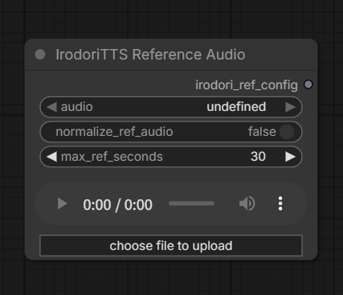

参照音声設定を作成します。

主な入力:

- `audio`: ComfyUIの`input`フォルダ内の音声または動画
- `normalize_ref_audio`: 参照音声を-16dB基準で正規化
- `max_ref_seconds`: 参照として使う最大秒数

動画を使う場合は、`imageio-ffmpeg`またはシステムの`ffmpeg`が必要です。

### IrodoriTTS VoiceDesign Config

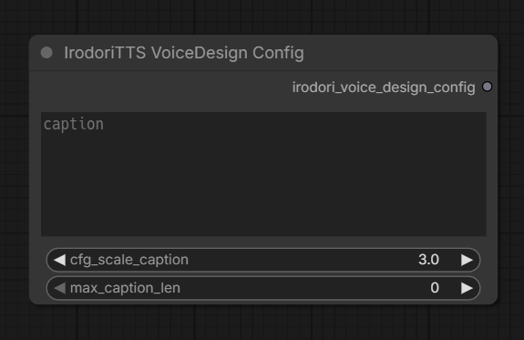

VoiceDesignモデル向けのキャプション設定を作成します。

主な入力:

- `caption`: 声質・話し方・感情などの説明文
- `cfg_scale_caption`: キャプション条件のCFG強度
- `max_caption_len`: キャプションtoken長の上限

### IrodoriTTS CFG Config

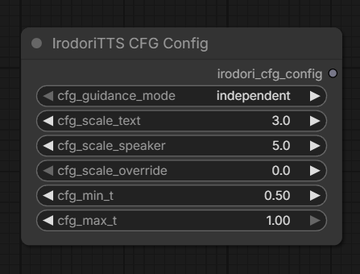

CFGの詳細設定を作成します。

主な入力:

- `cfg_guidance_mode`: `independent`、`joint`、`alternating`
- `cfg_scale_text`: テキスト条件の強度
- `cfg_scale_speaker`: 話者条件の強度
- `cfg_scale_override`: 全CFG条件の共通強度
- `cfg_min_t`: CFGを適用する拡散時刻の下限
- `cfg_max_t`: CFGを適用する拡散時刻の上限

まずは未接続の標準値で試し、必要に応じて調整してください。

### IrodoriTTS Duration Config

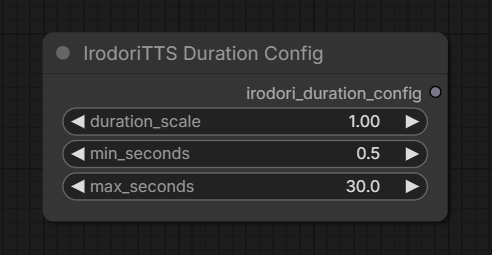

v3モデルの自動秒数推定に関する詳細設定を作成します。

主な入力:

- `duration_scale`: 自動推定された秒数の倍率
- `min_seconds`: 自動推定で許可する最短秒数
- `max_seconds`: 自動推定で許可する最長秒数

Samplerの`seconds`が`0`のときに自動推定が有効になります。未接続時は`duration_scale = 1.0`、`min_seconds = 0.5`、`max_seconds = 30.0`を使用します。

### IrodoriTTS Rescale Config

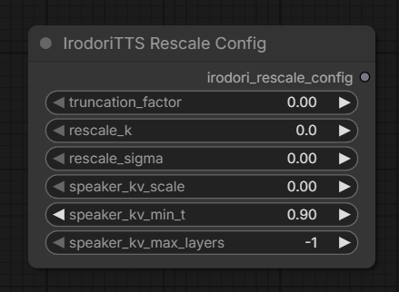

潜在の振れ幅や話者条件を補正する詳細設定を作成します。

主な入力:

- `truncation_factor`: 潜在の振れ幅を抑える係数
- `rescale_k`: Rescale補正の強さ
- `rescale_sigma`: Rescale補正のsigma
- `speaker_kv_scale`: 話者条件K/Vの強調
- `speaker_kv_min_t`: speaker K/V補正を適用し始める拡散時刻
- `speaker_kv_max_layers`: speaker K/V補正を適用する最大レイヤー数

各値は`0`以下で無効になります。

### IrodoriTTS Schedule Config

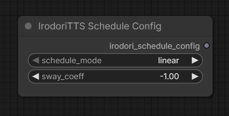

RFサンプリングの時刻スケジュール設定を作成します。

主な入力:

- `schedule_mode`: `linear`、`sway`
- `sway_coeff`: `sway`時のスケジュール係数

未接続時は`linear`で生成します。通常は`linear`で試し、生成の安定性や質感を比較したい場合に`sway`を使用します。

### IrodoriTTS Trim Tail Config

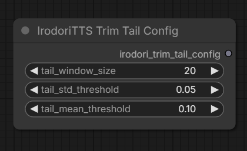

末尾切り詰め判定の詳細設定を作成します。

主な入力:

- `tail_window_size`: 末尾判定に使う潜在窓サイズ
- `tail_std_threshold`: 標準偏差しきい値
- `tail_mean_threshold`: 平均値しきい値

Samplerの`trim_tail`が有効なときに使用されます。未接続時は`tail_window_size = 20`、`tail_std_threshold = 0.05`、`tail_mean_threshold = 0.1`を使用します。

### IrodoriTTS LoRA Stack

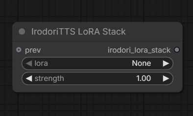

IrodoriTTS向けLoRAを選択し、Samplerへ渡すためのスタックを作成します。

主な入力:

- `prev`: 前段のLoRA Stack
- `lora`: 追加するLoRA
- `strength`: 適用強度

### IrodoriTTS Emoji Picker

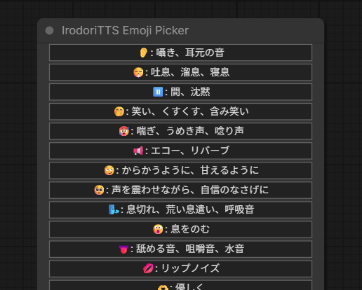

IrodoriTTSで使いやすい絵文字を選ぶためのUIノードです。ワークフロー上の生成処理には出力を接続しません。

### Irodori Character Voice Sampler

キャラクター画像を条件に音声を生成します。`IrodoriTTS Model Loader`の出力を接続し、Character Voice対応チェックポイントを選択して使用します。

主な入力:

- `model_config`: `IrodoriTTS Model Loader`の出力
- `character_image`: 声質や話し方の条件に使うキャラクター画像
- `text`: 読み上げるテキスト
- `seed`: 生成シード
- `seconds`: 生成する音声長
- `num_steps`: サンプリングステップ数
- `cfg_scale_character`: キャラクター画像条件のCFG強度

既存の`IrodoriTTS CFG Config`、`IrodoriTTS Rescale Config`、`IrodoriTTS Trim Tail Config`を任意で接続できます。参照音声やVoiceDesignキャプションは使用しません。

## 生成設定の目安

- まずは`num_steps = 40`、`seconds`は生成したい音声より少し長めに設定します。
- 同じ設定で別候補を出したい場合は`seed`を変更します。
- 音声の末尾が長く残る場合は`trim_tail`を有効にします。
- VRAMが厳しい場合は`codec_device = cpu`や`decode_mode = sequential`を試してください。
- 参照音声の影響が弱い場合は、`IrodoriTTS CFG Config`の`cfg_scale_speaker`を少し上げます。

## トラブルシューティング

### モデルが一覧に表示されない

チェックポイントを`ComfyUI/models/checkpoints`配下に配置し、ComfyUIを再起動してください。

### 動画から参照音声を使えない

`requirements.txt`に含まれる`imageio-ffmpeg`をインストールするか、システムに`ffmpeg`をインストールしてください。

### メモリ不足になる

以下を順に試してください。

- `batch_size`を`1`にする
- `decode_mode`を`sequential`にする
- `codec_device`を`cpu`にする
- `seconds`を短くする
- `num_steps`を下げる

### 生成結果がテキストに追従しにくい

`IrodoriTTS CFG Config`を接続し、`cfg_scale_text`を少し上げてください。上げすぎると音質や自然さが崩れる場合があります。

## ライセンス

このカスタムノードのライセンスはリポジトリ内の[LICENSE](./LICENSE)を確認してください。

Irodori-TTS本体、Emoji-TTS、および各モデルのライセンスは、それぞれの配布元を確認してください。
